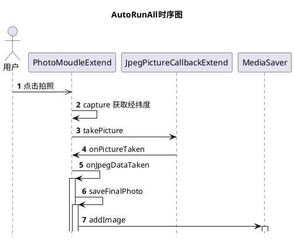

欢迎使用 **{小书匠}(xiao shu jiang)编辑器**，您可以通过==设置==里的修改模板来改变新建文章的内容。

# 1 流程
PhotoMoudleExtend.saveFinalPhoto --> addImage
## 1.1 拍照时序图

在capture方法中通过
```
final Location loc = mActivity.getLocationManager().getCurrentLocation();
```
获取的经纬度信息
# 2 存储过程
GPS信息 保存在照片的EXIF数据中

## 2.1 什么是EXIF信息

Exif (Exchangeable image file format) 是可交换图像文件的缩写，是专门为数码相机的照片设定的，可以记录数字照片的属性信息和拍摄数据。

Exif 最初由日本电子工业发展协会在 1996 年制定，版本为 1.0。1998 年，升级到 2.1，增加了对音频文件的支持。2002 年 3 月，发表了 2.2 版。

Exif 可以附加于 JPEG、TIFF、RIFF 等文件之中，为其增加有关数码相机拍摄信息的内容和索引图或图像处理软件的版本信息。

Exif 是一个为数码相机使用的图像文件格式而制定的标准规格。它由日本电子工业发展协会(JEIDA - Japan Electronic Industry Development Association)创建。该规格使用现有的文件格式，如 JPEG，TIFF Rev. 6.0，和 RIFF WAVE 音频文件格式，和一些额外添加的特殊元数据标签。它不支持 JPEG 2000 或 PNG。

照片拍摄地的位置信息。可以由 GPS(全球卫星定位系统)接收器连接到数码相机上，来提供相关全球定位信息。2004 年，仅有极少数数码相机支持这个特性。因此，有人使用普通的GPS接受器来记录他当时所在位置的地理信息，然后在图像的时间戳里，根据接受器日志记录的内容，为图像添加相机错失了的照片拍摄地地理信息。

# 2.2 修改Exif
[Android 实现对图片 Exif 的修改（Android 自带的方法）](http://blog.csdn.net/molashaonian/article/details/51378336)
主要通过ExifInterface 接口的设置属性的方法setAttribute(key, value)
ExifInterface.TAG_GPS_IFD
