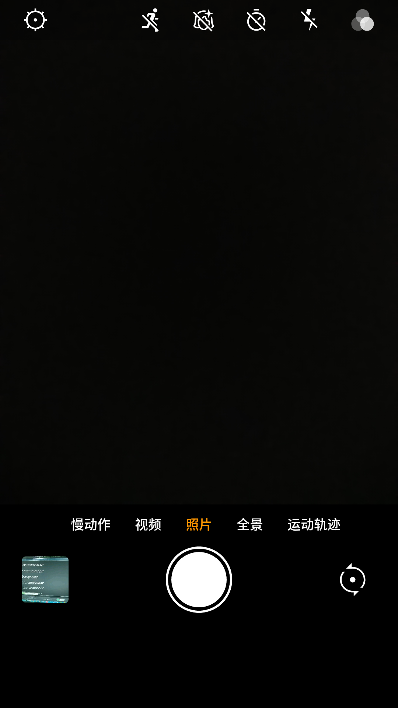
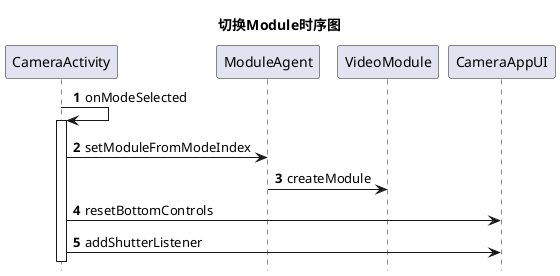
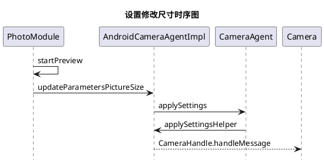
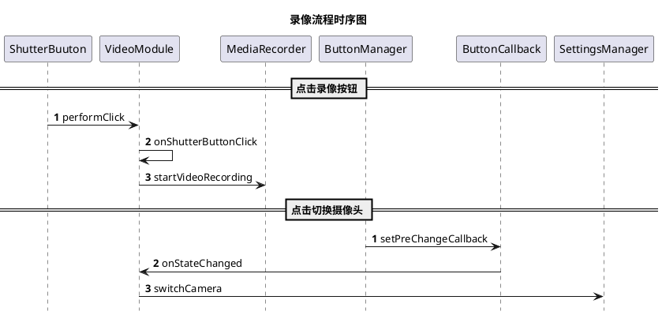
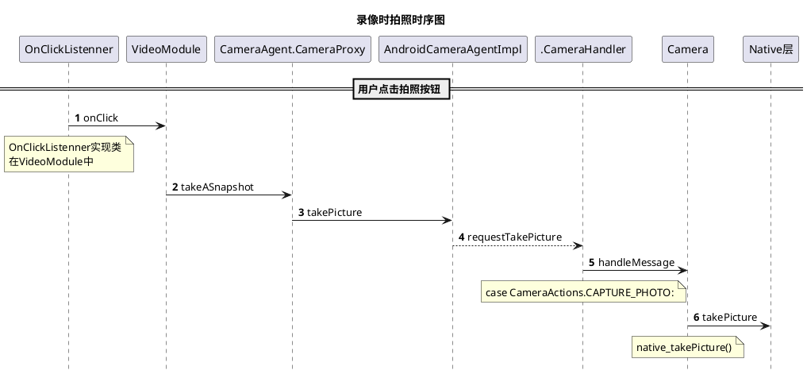

# 简介
>源码路径

rom/JUI/APP_ZsCamera

>apk 路径

qcom/spf.2.0/vendor/zeusis/app/ZsCamera

>y3o 8.1路径

qcom/spf.3.0.1/platform/packages/apps/SnapdragonCamera 

骁龙相机
qcom/spf.3.0.1/platform/packages/apps/Camera2

# 8.1骁龙相机
## 默认改成16:9
pref_camera_picturesize_title 照片尺寸
```xml
<IconListPreference
camera:key="pref_camera_picturesize_key"
camera:singleIcon="@drawable/ic_settings_picturesize"
camera:title="@string/pref_camera_picturesize_title"
camera:entries="@array/pref_camera_picturesize_entries"
camera:entryValues="@array/pref_camera_picturesize_entryvalues" />

```
**entries & Values**
```xml
    <!-- Camera Preferences Picture size dialog box entries -->
    <string-array name="pref_camera_picturesize_entries" translatable="false">
        <item>@string/pref_camera_picturesize_entry_24mp</item>
        <item>@string/pref_camera_picturesize_entry_21mp</item>
        <item>@string/pref_camera_picturesize_entry_16mp</item>
        <item>@string/pref_camera_picturesize_entry_16mp_wide</item>
        <item>@string/pref_camera_picturesize_entry_13mp</item>
        <item>@string/pref_camera_picturesize_entry_12mp</item>
        <item>@string/pref_camera_picturesize_entry_8mp</item>
        <item>@string/pref_camera_picturesize_entry_8mp</item>
        <item>@string/pref_camera_picturesize_entry_square</item>
        <item>@string/pref_camera_picturesize_entry_5mp</item>
        <item>@string/pref_camera_picturesize_entry_5mp</item>
        <item>@string/pref_camera_picturesize_entry_5mp</item>
        <item>@string/pref_camera_picturesize_entry_4mp_wide</item>
        <item>@string/pref_camera_picturesize_entry_3mp</item>
        <item>@string/pref_camera_picturesize_entry_3mp</item>
        <item>@string/pref_camera_picturesize_entry_1920x1080</item>
        <item>@string/pref_camera_picturesize_entry_2mp</item>
        <item>@string/pref_camera_picturesize_entry_2mp_wide</item>
        <item>@string/pref_camera_picturesize_entry_1_5mp</item>
        <item>@string/pref_camera_picturesize_entry_1_3mp</item>
        <item>@string/pref_camera_picturesize_entry_1280x768</item>
        <item>@string/pref_camera_picturesize_entry_1280x720</item>
        <item>@string/pref_camera_picturesize_entry_1mp</item>
        <item>@string/pref_camera_picturesize_entry_800x600</item>
        <item>@string/pref_camera_picturesize_entry_800x480</item>
        <item>960 x 720</item>
        <item>720 x 480</item>
        <item>@string/pref_camera_picturesize_entry_vga</item>
        <item>@string/pref_camera_picturesize_entry_352x288</item>
        <item>@string/pref_camera_picturesize_entry_qvga</item>
    </string-array>
    <!-- When launching the camera app first time, we will set the picture
         size to the first one in the list that is also supported by the
         driver -->
    <string-array name="pref_camera_picturesize_entryvalues" translatable="false">
        <item>5656x4242</item>
        <item>5344x4008</item>
        <item>4608x3456</item>
        <item>5312x2988</item>
        <item>4160x3120</item>
        <item>4000x3000</item>
        <item>3840x2160</item>
        <item>3264x2448</item>
        <item>2976x2976</item>
        <item>2592x1944</item>
        <item>2592x1936</item>
        <item>2560x1920</item>
        <item>2688x1512</item>
        <item>2048x1536</item>
        <item>2048x1520</item>
        <item>1920x1080</item>
        <item>1600x1200</item>
        <item>1920x1088</item>
        <item>1440x1080</item>
        <item>1280x960</item>
        <item>1280x768</item>
        <item>1280x720</item>
        <item>1024x768</item>
        <item>800x600</item>
        <item>800x480</item>
        <item>960x720</item>
        <item>720x480</item>
        <item>640x480</item>
        <item>352x288</item>
        <item>320x240</item>
    </string-array>

```

**第一次启动相机初始化相机尺寸,选择能支持的最大的尺寸,Y3手机摄像头传感器默认则是4:3**
com/android/camera/CameraSettings.java
```java
    public static void initialCameraPictureSize(
            Context context, Parameters parameters) {
        // When launching the camera app first time, we will set the picture
        // size to the first one in the list defined in "arrays.xml" and is also
        // supported by the driver.
        List<Size> supported = parameters.getSupportedPictureSizes();
        if (supported == null) return;
        for (String candidate : context.getResources().getStringArray(
                R.array.pref_camera_picturesize_entryvalues)) {
            if (setCameraPictureSize(candidate, supported, parameters)) {
                SharedPreferences.Editor editor = ComboPreferences
                        .get(context).edit();
                editor.putString(KEY_PICTURE_SIZE, candidate);
                editor.apply();
                return;
            }
        }
        Log.e(TAG, "No supported picture size found");
    }
```
现在只需加个判断宽高比为16:9的尺寸返回true即可
```java
+    /**
+     * BaoliYota begin, add
+     * what(reason)
+     * liuwenrong, 1.0, 2018/5/14
+     */
+    public static final float ASPECT_RATIO_16_9 = 16f / 9f;
+    //         3840x2160
+    public static boolean isAspectRatio16_9(String candidate) {
+
+        String [] heightWidth = candidate.split("x");
+        Log.d(TAG, "isAspectRatio16_9: 436------------ 180514 =heightWidth = " + heightWidth[0] + ", " +heightWidth[1]);
+        Float heightFloat = Float.valueOf(heightWidth[0]);
+        Float widthFloat = Float.valueOf(heightWidth[1]);
+        float aspectRatio = heightFloat / widthFloat;
+        Log.d(TAG, "isAspectRatio16_9: 440---------------180514= ASPECT_RATIO = " + ASPECT_RATIO_16_9 + ", heightFloat = " + heightFloat + ",widthFloat = " + widthFloat + ", aspectRatio = " + aspectRatio);
+        if ( Math.abs( ASPECT_RATIO_16_9 - aspectRatio) < 0.05 ) {
+            return true;
+        }
+
+       return false;
+    }
+    /** BaoliYota end */
```

# 相机主界面

`-><-



> **关键类**
 - com.android.camera.CameraActivity 首页
 - com.zeusis.camera.HFRVideoModule 慢动作
 - com.zeusis.camera.VideoModule 视频
 - com.zeusis.camera.PhotoModule 照片
 - com.zeusis.camera.WideAnglePanoramaModule 全景
 - com.zeusis.camera.motiontrack.MotionTrackModule 运动轨迹

# 相机配置参数
## Yota相机的参数Parameters
Android打开相机Camera.open时会获取参数
在AndroidCameraAgentImpl的CameraHandler的回调方法中
```java
public void handleMessage(final Message msg) {
	...
    switch (cameraAction) {
		case CameraActions.OPEN_CAMERA: {
			...
			mCamera = android.hardware.Camera.open(cameraId);
            if (mCamera != null) {
                mCameraId = cameraId;
                mParameterCache = new ParametersCache(mCamera);
                Camera.Parameters param = mParameterCache.getBlocking();
                if(param != null){
					 ...
                     mOriginParameter = Camera.getParametersCopy(param);
                }else {
                     Log.e(TAG,"error param == null");
               }
			...
        	break;
		}
		...
		case CameraActions.APPLY_SETTINGS: {
             Parameters parameters = mParameterCache.getBlocking();
             CameraSettings settings = (CameraSettings) msg.obj;
             applySettingsToParameters(settings, parameters);
             mCamera.setParameters(parameters);
             mParameterCache.invalidate();
             break;
          }

       case CameraActions.SET_PARAMETERS: {
            Parameters parameters = mParameterCache.getBlocking();
            parameters.unflatten((String) msg.obj);
            if (mCamera != null) {
                 mCamera.setParameters(parameters);
             }
             mParameterCache.invalidate();
           break;
       }
}
```

applySettingsToParameters()方法将设置变成相机的属性参数其中包括:
: setPreviewFormat()
: setJpegQuality
: setZoom 缩放
: setExposureCompensation 
: 等等
### CameraSettings将设置转换为参数Parameters

## PlatformCamera
PlatformCamera.setZsAlgo20defaultParameter()
ZS去设置一些参数,如美颜级别

如果想要修改那个属性，使用set方法，比如设置缩放
```java
if(parameters.isZoomSupported()){  
     //tenDesiredZoom取值在parameters.getMinZoom()与parameters.getMaxZoom()之间       
      parameters.set("zoom", String.valueOf(tenDesiredZoom));  
} 
```
想要获取设置的属性值就更简单了，直接调用下面的方法就搞定了：
```
parameters.get(String key);
```
## Parameters
下面列表中，等号前面的就是key值，后面就是对应属性值value：
``` java
class Camera {
	class Parameters{
		setPreviewFpsRange(min,max); //	预览照片时每秒显示帧数的最小值和最大值  key = preview-fps-range, value=min, max  "preview-fps-range-values" -> "(15000,15000),(20000,20000),(7500,24000),(24000,24000),(7000,30000),(30000,30000),(15000,30000)" 该值是帧率*1000 其中Y3是7000,30000
		setAntibanding(String antibanding) ;//设置屏幕刷新率,来降低条带效果 key= antibanding, 
		getSupportedAntibanding(); //获取可支持的屏幕刷新率 off,50hz,60hz,auto
		getSupportedPictureSizes();//获取可支持的图片大小 key=picture-size-values, "4032x3024,4000x3000,3840x2160,3264x2448,3264x1836,3200x2400,2592x1944,2688x1512,2048x1536,1920x1080,1440x1080,1280x960,1280x720,640x480,352x288,320x240,176x144"
		getMaxNumDetectedFaces();//获取能检测的最大人脸数量 key=max-num-detected-faces-hw, Y3的IMX386 值为10
		startFaceDetection();//开启人脸检测
	}
}


flatten:   
snapshot-picture-flip = off flip-v flip-h; 
//镜像模式: 当旋转 (rotation == 90 || rotation == 270)垂直翻转

jpeg-watermark = 0,1; 
//自动水印 mAutoWaterMarkEnable == false) ? 0 : 1; 0为关闭,1为打开 

picture-size=4160x3120;  //图片大小
picture-size-values=4128x3088,4128x2320,4160x3120,4160x2340 

preview-size   //预览大小

Anti-Flicker

capture-burst-interval-max=10;  
mirror-enable=0;  //镜像模式
zoom=31;  
redeye-reduction-values=enable,disable;  
max-num-detected-faces-hw=4;  
scene-detect-values=off,on;  
qc-camera-features=1;  
face-detection-values=off,on;  
cap-mode=normal;  
whitebalance=auto;  
max-sharpness=30;  
asd-mode=auto;  
preview-format-values=yuv420sp,yuv420sp-adreno,yuv420p,yuv420p,nv12;jpeg-thumbnail-quality=90;  
preview-format=yuv420sp;  
face-detection=off;  
video-hdr-values=off,on;  
camera-mode-values=0,1;  
auto-exposure-values=frame-average,center-weighted,spot-metering;
snapshot-flip=0;  
video-zoom-support=true;  
iso=auto;mce-values=enable,disable;  
video-hdr=off;  
flash-mode-values=off,auto,on,torch;  
preview-frame-rate=30;  
fb-smooting=90;  
jpeg-thumbnail-width=512;  
video-size=1920x1080;  
scene-mode-values=auto,asd,action,portrait,landscape,night,night-portrait,theatre,beach,snow,sunset,steadyphoto,fireworks,sports,party,candlelight,backlight,flowers,AR,hdr,macro,mix-illuminant,indoor;  
redeye-reduction=disable;  
preview-fps-range-values=(7577,30082);  
auto-exposure=frame-average;  
histogram=disable;  
fb-eye-enlargement=90;  
camera-mode=1;  
preview-size-values=1920x1080,1440x1080,1280x720,800x480,720x480,640x480,352x288,320x240,240x160,192x112,176x144;  
raw-size=4032x3024; //实际 原料 大小
touch-af-aec=touch-off;  
preview-fps-range=7577,30082;  
auto-whitebalance-lock=false;  
min-exposure-compensation=-12;  
antibanding=off;  
max-num-focus-areas=1;  
vertical-view-angle=48.3;  
display_mode=portrait;  
qc-max-num-requested-faces=2;  
capture-burst-exposures-values=-12,-11,-10,-9,-8,-7,-6,-5,-4,-3,-2,-1,0,1,2,3,4,5,6,7,8,9,10,11,12;  //曝光
slow-shutter=slow-shutter-off;max-saturation=10;capture-burst-interval-min=1;  
no-display-mode=0;max-contrast=10;  
slow-shutter-values=slow-shutter-off,slow-shutter-auto,slow-shutter-1/2s,slow-shutter-1s,slow-shutter-2s,slow-shutter-4s,slow-shutter-8s;  
picture-format-values=jpeg,raw;video-hfr=off;exposure-compensation-step=0.166667;  
scene-detect=off;  //场景侦测
saturation=5;  
fb-face-slimming=71;  
whitebalance-values=auto,incandescent,fluorescent,daylight,cloudy-daylight;  
picture-format=jpeg;zsl=off;  
reduce-purple=off;  
lensshade-values=enable,disable;  
selectable-zone-af=auto;  
video-hfr-values=off,60,90,120;  //视频High frame rate高帧率
iso-values=auto,ISO_HJR,ISO100,ISO200,ISO400,ISO800,ISO1600;  
selectable-zone-af-values=auto,spot-metering,center-weighted,frame-average;  
lensshade=enable;  
capture-burst-exposures=;  
preferred-preview-size-for-video=1920x1080;  
intelligent-mode=0;mce=enable;  
hfr-size-values=800x480,640x480;  
zoom-supported=true;  
strtextures=OFF;  
face-beautify=0;  
denoise-values=denoise-off,denoise-on;zsl-values=off,on;sharpness=10;  
contrast=5;  
scene-mode=auto;  
jpeg-quality=85;  
capture-burst-interval=1;  
video-skinbeauty-mode=off;  
histogram-values=enable,disable;  
overlay-format=265;metering-areas=(0,0,80,80,1000);  
capture-burst-captures-values=3;  
ideo-size-values=1920x1080,1280x1088,1280x720,800x480,720x480,640x480,480x320,352x288,320x240,192x112,176x144;skinToneEnhancement=0;fb-toning=90;  
preview-size=1440x1080;focal-length=3.85;  
ae-bracket-hdr-values=Off,HDR,AE-Bracket;  
denoise=denoise-off;capture-burst-retroactive=0;  
video-flip=0;  
preview-frame-rate-values=5,6,7,8,9,10,11,12,13,14,15,16,17,18,19,20,21,22,23,24,25,26,27,28,29,30,31,32,33,34,35,36,37,38,39,40,41,42,43,44,45,46,47,48,49,50,51,52,53,54,55,56,57,58,59,60,61,62,63,64,65,66,67,68,69,70,71,72,73,74,75,76,77,78,79,80,81,82,83,84,85,86,87,88,89,90,91,92,93,94,95,96,97,98,99,100,101,102,103,104,105,106,107,108,109,110,111,112,113,114,115,116,117,118,119,120;  //预览帧率
power-mode-supported=true;  
max-num-metering-areas=1;  
face_position=(-1,-1);  
preview-flip=0;  //预览翻转 off on
focus-mode-values=auto,infinity,normal,macro,continuous-picture,continuous-video;  
action-mode=all;  
power-mode=Normal_Power;  
jpeg-thumbnail-size-values=512x288,480x288,432x288,512x384,352x288,320x240,192x112,176x144,0x0;  
zoom-ratios=100,102,104,107,109,112,114,117,120,123,125,128,131,135,138,141,144,148,151,155,158,162,166,170,174,178,182,186,190,195,200,204,209,214,219,224,229,235,240,246,251,257,263,270,276,282,289,296,303,310,317,324,332,340,348,356,364,373,381,390;  
single-isp-output-enabled=false;  
 
```
# ->相机设置尺寸<-
## 关键类和布局
Class类
: CameraSettingActivity, 
: CameraSettingsActivity, 
: CameraSettings,
: PhotoModuleExtend, 

res资源文件
: camera_preferences_zs.xml  设置的列表布局

设置Settings->![enter description here][2]<-

后置相机分辨率尺寸的camera_preferences_zs.xml代码
```xml
    <!-- BACK camera PHOTO resolution -->
    <ListPreference
        android:defaultValue="@string/pref_camera_picturesize_default"
        android:entryValues="@array/pref_camera_picturesize_entryvalues"
        android:key="pref_camera_picturesize_back_key"
        android:negativeButtonText="@null"
        android:positiveButtonText="@null"
        android:title="@string/setting_back_camera_photo"/>
```
在com.android.camera.settings.Keys中
```java
    public static final String KEY_PICTURE_SIZE_BACK = "pref_camera_picturesize_back_key";
```
在CameraSettingsActivity的setEntries(Preference preference)方法中
```java
ListPreference listPreference = (ListPreference) preference;
if (listPreference.getKey().equals(Keys.KEY_PICTURE_SIZE_BACK)) {
          setEntriesForSelection(mPictureSizes.backCameraSizes, listPreference);
}
```
在返回相机首页时,会调用com.android.camera.settings.ResolutionSetting.getPictureSize()方法
```java
final String pictureSizeSettingKey = cameraFacing == OneCamera.Facing.FRONT ?
Keys.KEY_PICTURE_SIZE_FRONT : Keys.KEY_PICTURE_SIZE_BACK;
		...
pictureSize = SettingsUtil.sizeFromSettingString(
mSettingsManager.getString(SettingsManager.SCOPE_GLOBAL,
pictureSizeSettingKey));

```
### 4:3时
启动相机或进入相机预览界面 都会调用 AndroidCameraAgentImpl的CameraHandler.handleMessage 
CameraActions.APPLY_SETTINGS

AndroidCameraSettings
mCurrentPhotoSize = Size: (4032 x 3024)
mCurrentPreviewSize = Size: (1440 x 1080)
### 16:9时
AndroidCameraSettings
mCurrentPhotoSize = Size: (3840 x 2160)
mCurrentPreviewSize = Size: (1920 x 1080)

## 时序图


ResolutionUtil. getDisplayableSizesFromSupported
从17种可用的尺寸中选出2种最大的4:3和16:9

List<ResolutionBucket> buckets 
 : aspectRatio = 1.3333334  4:3  4160x3120
 : aspectRatio = 1.77777778 16:9  3840x2160
 : aspectRatio

## 总结
如果要改成**18:9**的话,需要将aspectRatio的值改成2,底层需要支持的photo-size 也要相应的修改

# 适配(全面屏18:9)
## 资源适配
### 声明最大高宽比
在应用配置文件AndroidManifest.xml中显式声明支持的最大屏幕高宽比（maximum aspect ratio）。其中 ratio_float 为高宽比：
传统屏幕：ratio_float = 16/9 = 1.778 ；
T6屏幕 : ratio_float = 18/9  = 2;
三星S8屏幕：ratio_float = 18.5/9 = 2.056。
鉴于目前全面屏屏幕比例，将ratio_float设置为2.1即可适配一众全面屏手机。
```xml
<meta-data 
  android:name="android.max_aspect"
  android:value="ratio_float" />
```
然而有一点需要注意的是，在Android 7.0以上Google默认支持了分屏模式，即Manifest文件中配置Activity的android:resizeableActivity默认属性为true，在这种情况下并不需要配置Maximum Aspect Ratio即可自动适配全面屏。

如果从来没有处理过 android.max_aspect，也没有设置 android:resizeableActivity为true。那么你的应用在某些手机中，就会出现上下黑边的情况

### 图片适配和dimens尺寸适配
考虑到目前大部分全面屏手机只是在高度上拉长，且大多为6.0英寸左右，像素密度对比xxhdpi并没有多大区别，那我们可以在项目中增加一组资源drawable-xxhdpi-2160x1080 、drawable-long 这样解决图片的拉伸问题，当然最好的方法还是用相对布局采用XML的方式,或者.9图的解决方案。

dimens.xml在values文件夹中
适配的18:9的dimens.xml则应该放在values-2160x1080 , 

## 代码适配
### 判断机型适配

```java
Log.d(TAG, "onCreate: ----------------------------180326");
String DeviceName = android.os.Build.DEVICE;
Log.d(TAG, "onCreate:----------180326 DeviceName = " + DeviceName);
```

03-26 10:42:17.838 11609-11609/com.roger.demo4roger D/Main: onCreate: ----------------------------180326
03-26 10:42:17.838 11609-11609/com.roger.demo4roger D/Main: onCreate:----------180326 DeviceName = T6


03-26 10:40:51.338 28478-28478/com.roger.demo4roger D/Main: onCreate: ----------------------------180326
03-26 10:40:51.338 28478-28478/com.roger.demo4roger D/Main: onCreate:----------180326 DeviceName = Y3

从log来看,获取机型不足1ms,效率很高,当代码改动量很小时,可以采用该方案
就比如相机尺寸在Y3上是16:9,而在T6,Y4机型上是18:9

### 通过Flavors适配
1. 如要区分Y3和T6,首先需增加Y3和T6的目录
- src
	- main
		- java
		- res
	- Y3
		- java
		- res
	- T6
		- java
		- res

2. 然后是build.gradle
```
android {
	...
// Specifies a flavor dimension.维度
    flavorDimensions "Yota"

    productFlavors {
        Y3 {
            dimension "Yota"
        }
        T6 {
            dimension "Yota"
        }
    }

    sourceSets {
//  Y3 { // 当flavors的命名跟文件夹同名时,可以不用指定下面的资源路径
//
//  }
        T6 { 
            manifest.srcFile 'src/T6/AndroidManifest.xml' //manifest会被合并到app的main的manifest文件中
            java.srcDirs 'src/T6/java' //java目录下的文件会被添加到main里的java目录中，所以不能和main里的类重名（含包名）
            res.srcDirs 'src/T6/res' //res目录下的资源文件会替换main里的资源文件
        }
    }
}
```
3. 将要适配的类,即Y3和T6功能不同的类放到各自的目录中去,没有差异的类就放到main中

## 思考
1. 什么时候直接判断机型,什么时候用Flavors?
2. 还有其他更好的适配方案吗?大家可以讨论一下

# T6拍照完卡住的Bug
## 分析
猜测:拍完照没有回调,导致没有startPreview()
通过Y3和T6的相机调试打断点,发现基本一致
当断点到T6的Parameters时,size为79-80个
而Y3 size有200-209个,应该是Framework层的Camera相关代码没有移植完导致的

# 录像的流程
## 录像时序图


在com.android.camera.VideoModule.**startVideoRecording**方法主要开启录像和隐藏/显示一些图标
```java
mMediaRecorder.start(); // Recording is now started

mAppController.getCameraAppUI().hideModeOptions();
mAppController.getCameraAppUI().animateBottomBarToVideoStop(getVideoStopDrawable());
mUI.showRecordingUI(true);

```
### 布局

 - camera.xml  camera_zs.xml 根布局
	- sticky_bottom_capture_layout
		-  mode_options_overlay.xml  菜单选项布局
		- bottom_bar_contents_zs.xml 
			- 拍照按钮 shutter_button

## 增加录像时拍照功能
>确定控件类型
1. ShutterButton 包含接口回调方法,包括长按,获取焦点等回调方法 拍照录像的按钮就是这种控件
2. CameraToggleImageButton 开关的按钮,有状态,如前摄,后摄状态
3. ImageButton 普通按钮


### 方案一  

 ->**使用ShutterButton**<-

**需要增加一个OnShutterButtonListener**

> 添加时机,有3种方案
 - 启动应用时添加监听,不移除监听
 - [x] 打开录像的Module时添加监听,滑动到其他Module是移除监听
 - 按下录像按钮时添加监听,停止录制时移除监听

> OnShutterButtonListener的接口方法实现在哪个类中比较合适
- VideoModule中判断按钮id区分录像按钮和拍照按钮 **可惜接口回调方法中不带id**
- 新建一个类实现该接口方法 
在CameraActivity的onModeSelected方法中
```java
if (mCurrentModule instanceof VideoModule) {
	if (mTakePhotoOnVideo == null) {
		mTakePhotoOnVideo = new TakePhotoOnVideo(this);
		.addShutterListenerByTakePhotoOnVideo(mTakePhotoOnVideo);
	}
}
```
在调试过程中发现**com.android.camera.VideoModule**有个takeASnapshot()方法
然后实现View.OnClickListenner只需调用该方法即可

### 录像时拍照时序图


## 增加录像暂停继续功能
### 设置视频路径流程图

```sequence
title: 视频暂停继续时序图
VideoModule->MediaRecorder : initializeRecorder
MediaRecorder->xxx: setOutputFile
```

```flow
title:aaa
st=>start: 开始
e=>end: 结束
op=>operation: 我的操作
cond=>condition: 确认？

st->op->cond
cond(yes)->e
cond(no)->op
```
```sequence
张三->李四: 嘿，小四儿, 写博客了没?
Note right of 李四: 李四愣了一下，说：
李四-->张三: 忙得吐血，哪有时间写。
```

  [1]: ./images/camera.png "camera"
  [2]: ./images/CameraSettings.png "CameraSettings"