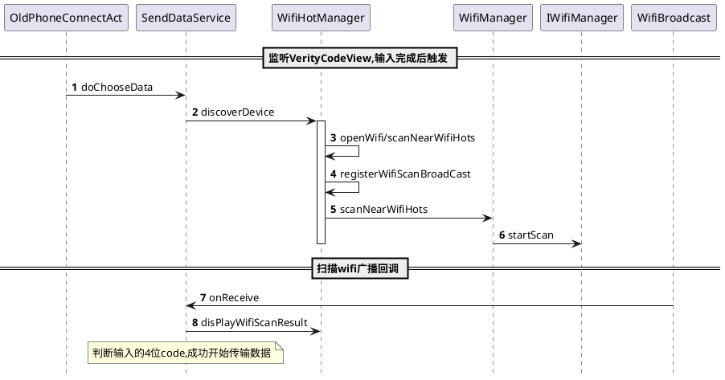

欢迎使用 **{小书匠}(xiao shu jiang)编辑器**，您可以通过==设置==里的修改模板来改变新建文章的内容。

# 如何编译到系统中
加入qcom/spf.2.0/platform/manifest / yota/msm8953_t6_dev.xml
```xml
  <project name="vendor/zeusis/app/Cloneit"/>
  ```
 qcom/spf.2.0/device/zeusis / common/zsui.mk
 ```xml
 ZSUI_APPS := \
    Cloneit \
 ```
 或者 在device/zeusis/T6/T6.mk
 ```xml
 PRODUCT_PACKAGES += \
    CY_BLauncher \
    CY_BReader \
	Cloneit \
 ```
 ## 代码仓库
 rom/JUI/APP_CloneIt
rom/JUI/APP_CloneItOtherPhone
## apk仓库
qcom/spf.2.0/vendor/zeusis/app/Cloneit

# 控制APP渠道
Constants.CHANNEL来区分Yota手机还是其他手机
**CloneItApplication.initParams()** 方法中写入该值

# 连接热点流程
## 时序图


Android7.1的努比亚z17s,广播得不到WiFiList
下了**换机精灵** Y3和T6可以传资料,但是z17s始终连不上WiFi
**换机助手** T6闪退,z17s无法创建热点

小米5s 
com.zeusis.commonui.widget.checkbox.ZeusisCheckbox
com.journeyui.cloneit.adapter.ChooseMainAdapter.getView(ChooseMainAdapter.java:127)
at com.zeusis.commonui.widget.listview.ZeusisListView.layoutChildren(Unknown Source)