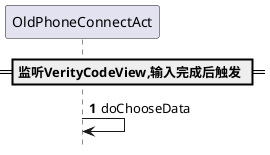

欢迎使用 **{小书匠}(xiao shu jiang)编辑器**，您可以通过==设置==里的修改模板来改变新建文章的内容。

# 控制APP渠道
Constants.CHANNEL来区分Yota手机还是其他手机
**CloneItApplication.initParams()** 方法中写入该值

# 连接热点流程
## 时序图

```plantuml!
@startuml
hide footbox
autonumber
== 监听VerityCodeView,输入完成后触发 ==
OldPhoneConnectAct -> OldPhoneConnectAct : doChooseData

```