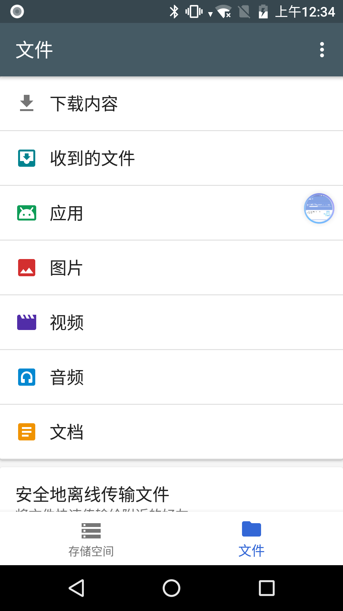
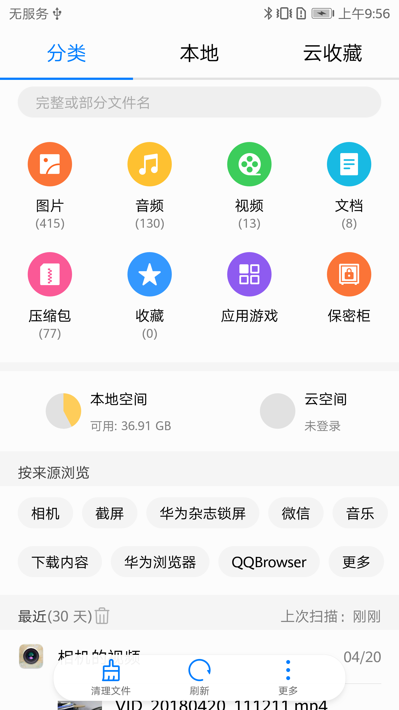
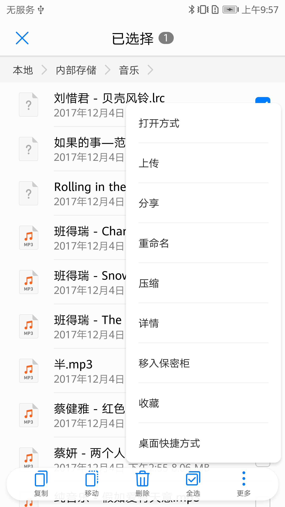
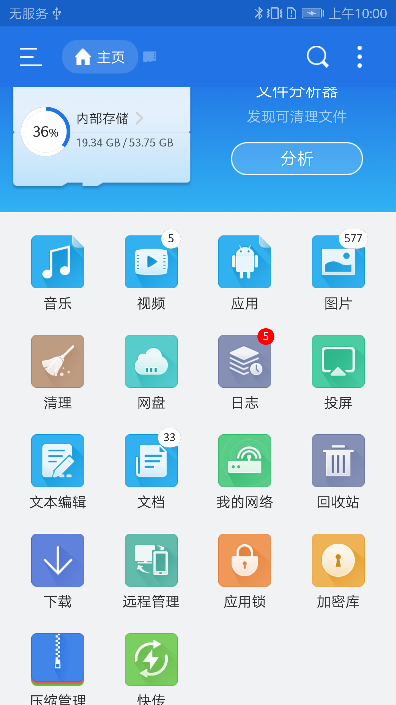
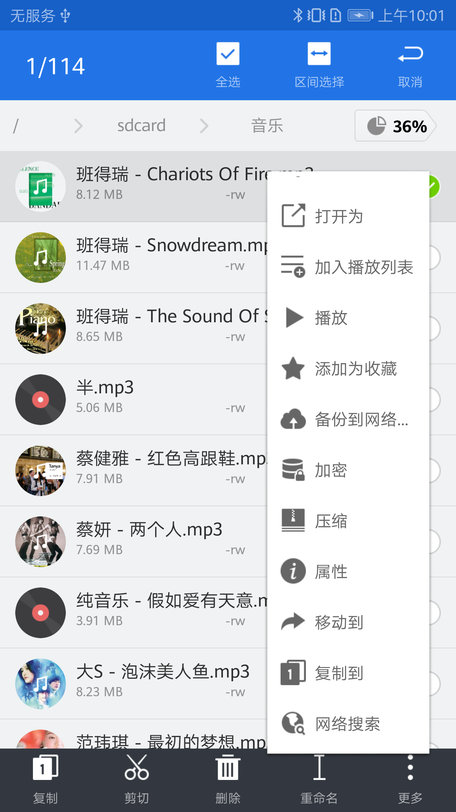
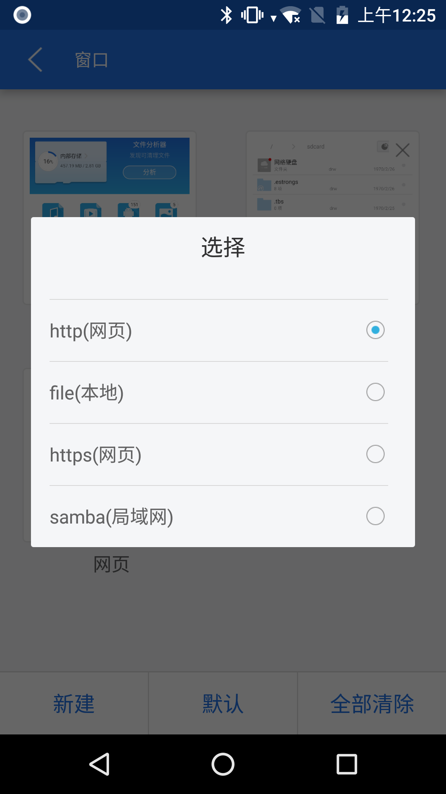
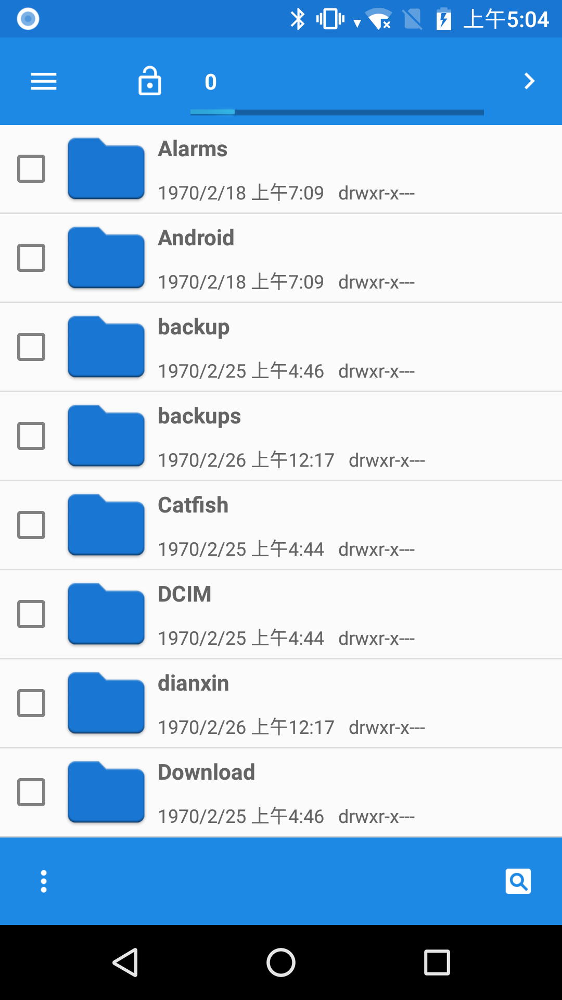

# 一. 背景
> 分析各主流的文件管理器的功能和源生的文件管理器对比,然后改进源生文件管理器,使其更符合国人的用户习惯.

# 二. 竞品对象
1. 谷歌的Files Go
2. 华为的文件管理器8.1
3. Es文件管理器
4. Android系统源生文件管理器

# 三. 竞品分析(定位和功能)

> 文件管理的基础功能
- 列表显示SD卡的所有文件夹和文件
- 剪切，复制，粘帖功能
- 创建文件夹功能

## 3.1 谷歌的Files Go
> **定位**
- 扫描文件,优化和清理磁盘空间
> **功能**
- 分析文件,找出重复文件
- 文件分类:应用,图片,视频,音频,文档
- WiFi蓝牙文件互传

> 没有找到显示sdcard的文件列表




## 3.2 华为手机的文件管理器功能
> **定位**
- 云服务,安全隐私
> **功能**
- 分类功能 :图片,音频,视频,文档,压缩包,应用,收藏
- 按来源浏览:相机,微信,截屏,浏览器,音乐...
- 最近30天 一个列表
- 压缩
- 保密柜
- 云收藏
- 桌面快捷方式





## 3.3 ES文件浏览器
> **定位**
- 功能齐全,属于第三方的文件管理器
> **功能**
- 分析:大文件,清理
- 回收站
- 投屏,远程管理,应用锁,压缩管理,快传
- 多窗口功能:每一个窗口可以指定一个文件夹路径,网络地址或局域网地址
- 新文件悬浮窗提示功能







## 3.4 源生文件管理器界面和功能
> **定位**
- 功能简单,很多都是源生的控件
- 界面和操作习惯有些不符合国人的用户习惯
> **功能**
- 默认有勾选框
- 浏览历史和书签
- 快速搜索




# 四. 结论
## 需要增加的产品功能
-  文件分类功能在另一个APP(文件)中,需要整合在一起
- 针对30多种不同文件类型显示不同的图标
- 压缩功能
- 显示或者隐藏文件

# zeusis众思的FileBrowser
依赖的commonui控件:
搜索commonui,搜到了194项
```java
import com.zeusis.commonui.widget.dialog.ZeusisDialog;
import com.zeusis.commonui.widget.listview.ZeusisListView;
import com.zeusis.commonui.widget.pulltorefresh.PullToRefreshLayout;
```
但其中代码使用了的控件不好计算,估计差不多有一千处

搜索Zeusis,搜到了314项 