# 界面和特点

## Solid Explorer
- **Solid Explorer** 界面配色很符合安卓源生的Metarial Design质感设计,用户可以自定义配色
- 查看图片只能通过其他应用查看
- 侧滑风格
- 云服务支持，包括：Dropbox，Box，Google Drive，Onedrive，Mega以及Owncloud 不过很多在国内用不了
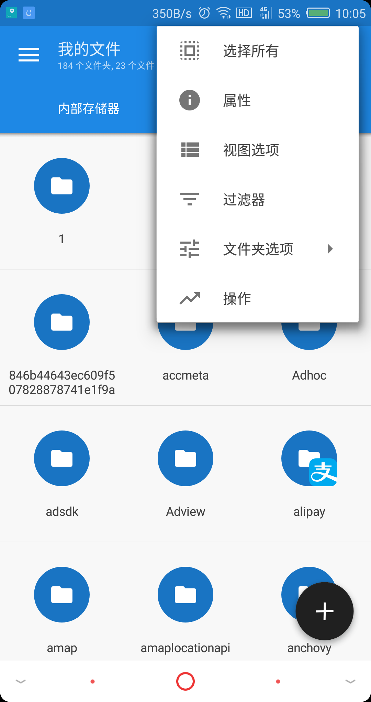  
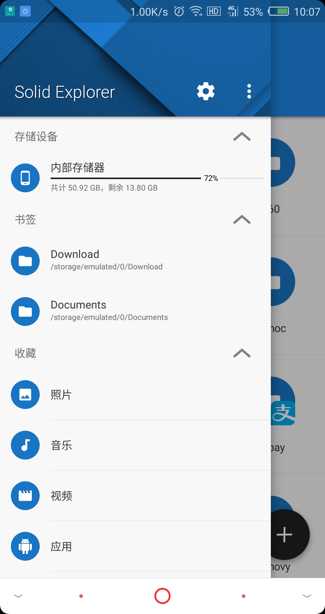

## 华为文件管理器v7.1.1.318 安卓版
> **优点**
- 此版本为华为提供给其他手机下载,名字叫做**文件管理**
- 功能比较齐全

> **缺点**
- 应用游戏会推荐下载华为游戏中心
- 如果需要使用云收藏,会下载华为账号
- 比华为自带的8.1版本少了**按来源浏览**和**最近30天**
- 替华为提供了潜在的客户
- 可能存在被吐槽,鄙视的风险,当然也可能被误认为跟华为有合作
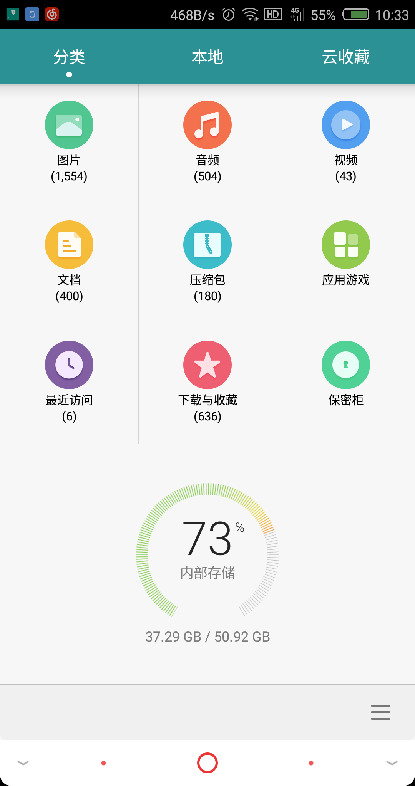
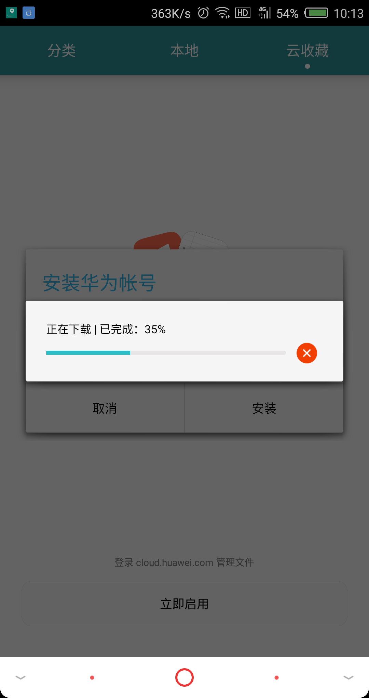

## ==360文件管理器==
- 在桌面名字为**超级文件管理器**
- 有360云盘,但是360云盘服务器在17年已经关闭了,而且界面也很老,明显没有维护了
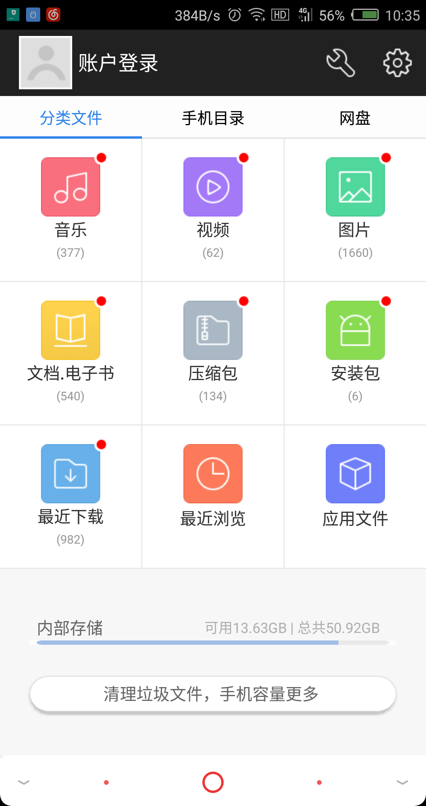
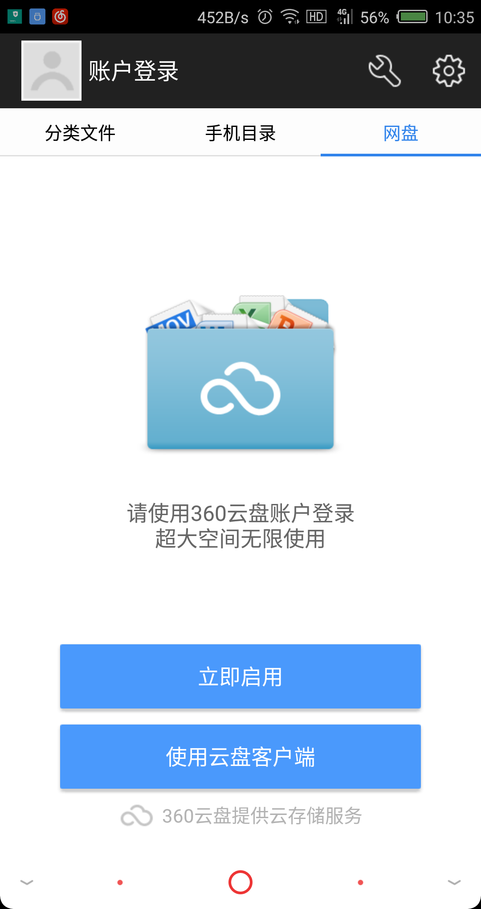

## 超级文件管理
- 界面比较老
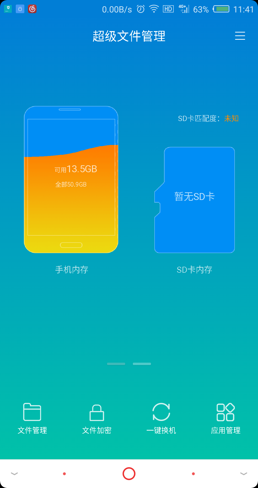
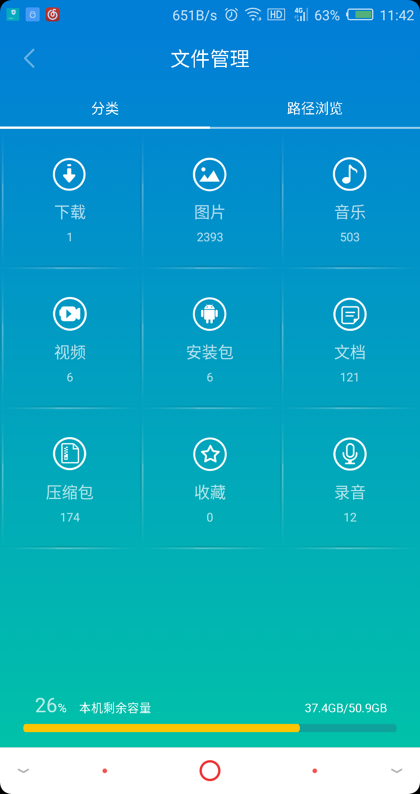

## ==Well文件管理==
- 界面简洁
- 文件分类
- ==安装Clud Agent闪退==
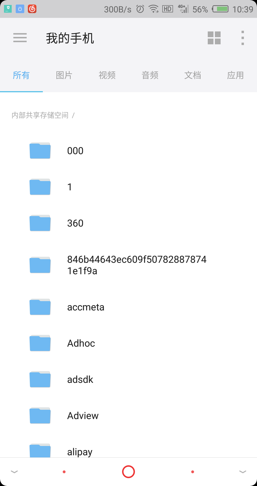
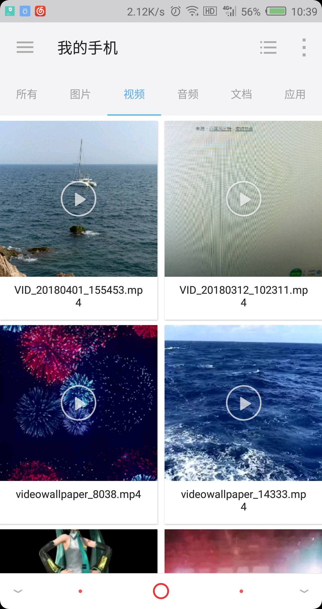

## ES文件浏览器
- 功能复杂,界面不够美观
- 存在ES自己的招聘广告
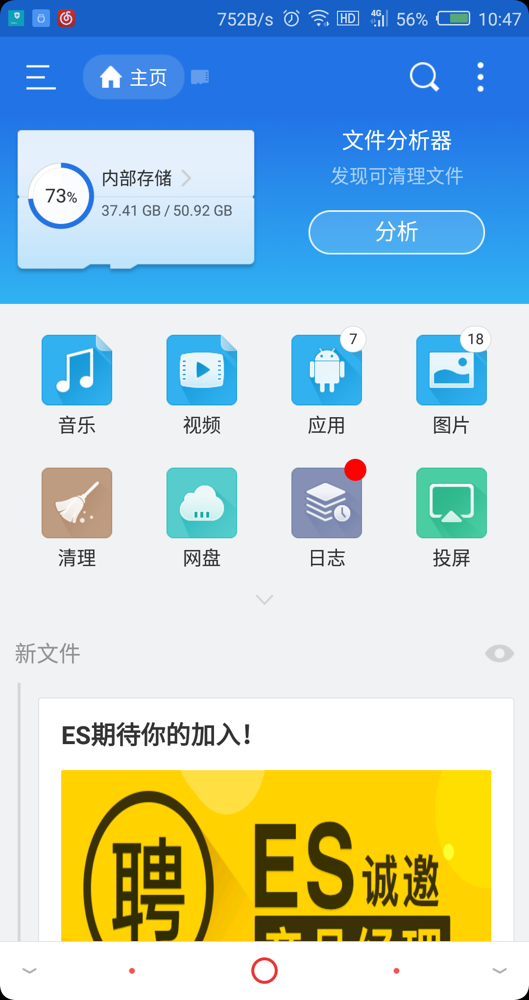

## ==Cabinet==
- 文件显示有问题,应该没有权限,还会闪退
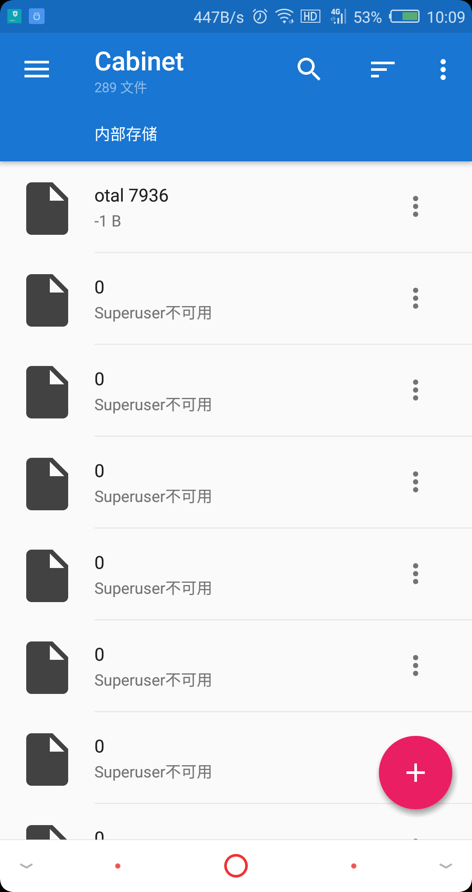 

## ==文件大师 / File Expert==
- 有广告 
# 有广告
- 文件大师 : 底部有个广告,点x需要登录和购买会员
- 文件管理器 : 启动页有快手的广告
- Solid文件管理器: 界面老,总是弹广告,应该是反编译的盗版应用

# 功能对比
> 去掉一些弹广告的,闪退,和不维护的应用,剩下的应用做功能对比

功能   \  APP | ES | 华为 | Solid | 超级文件管理
------------------| :--: | :--: | :--: | :--: | :--: | :--: |
文件分类  | √  | √ | √ | √ |
压缩 | √  | √ | √ | × |
文件清理 | √  | √ | × | √ |
按来源浏览 | × | × | × | × |
| 云服务 | × | √ | √ | × |
| 回收站 | √ | × | × | × |
| 加密库/保密柜 | √ | √ | √ | √ |

## 开发团队
> ES
- 网站打不开 
- www.estrongs.com 可能是国外的网站,被墙了,用VPN也打不开,也可能网站和应用已经不维护了
>Solid 
- NeatBytes  : 美国的一家公司,我去官网看,14年开始开发该产品,只有这么一款产品
> 超级文件管理
- 深圳海奇兵科技有限公司 : 于2015年05月29日在深圳市市场监督管理局注册成立,位于深圳市前海深港合作区前湾一路1号A栋201室（入驻深圳市前海商务秘书有限公司）
- 公司规模：30-50人运营中

# 流畅性和易用性
> 流畅性

> 易用性

## 加载页面有广告
- RE浏览器

## ES有自己的招聘广告